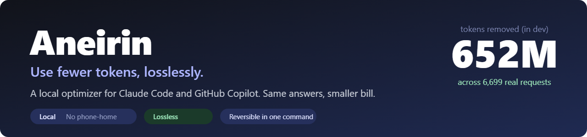
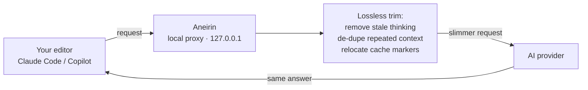
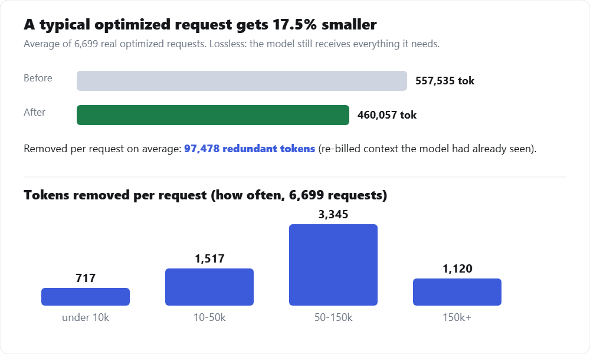

<p align="center">
  
</p>

<p align="center">
  
  
  
  
  
  
</p>

**Use fewer tokens, losslessly.** Aneirin is a local proxy that cuts the token cost of
Claude Code and GitHub Copilot. It runs on your own machine, uses your own account, and does
not change a single answer the model gives you.

**Free to start** — the full optimizer is free up to 5 million optimized tokens per day. Pro
removes the cap ($5/mo or $79 lifetime). No sign-up to try it: download, run, save tokens.

In development on one machine, Aneirin has physically removed **652 million billed tokens**
from real requests so far. These are redundant tokens the model had already seen. Same
answers, smaller bill.

> [!NOTE]
> **Lossless** means the model still receives everything it needs to answer correctly.
> Aneirin only trims context that is redundant or re-billed, never the meaning of your request.

## Download

**[⬇ Download the latest release](https://github.com/corbenicai/aneirin/releases/latest)** — Windows today (macOS and Linux to follow).

Grab `aneirin-windows-*.zip`, unzip it, and follow the three steps below. Verify your
download against the published `SHA256SUMS` if you wish.

## Get started (Windows)

Aneirin is a single program — `aneirin.exe`. No Node or other install needed.

```powershell
# 1. check it
.\aneirin.exe selftest          # → "Aneirin engine OK"

# 2. trust the local certificate (one time; generated on YOUR machine, never shipped)
.\aneirin.exe install-ca

# 3. run it (local optimizer on 127.0.0.1:8765 — leave it running)
.\aneirin.exe
```

Then send your AI tool's traffic through it:

```powershell
# Claude Code (CLI) — set for the session, then use Claude Code as normal:
$env:HTTPS_PROXY = "http://127.0.0.1:8765"
```

That puts you on the **Free** tier (full optimizer, 5,000,000 optimized tokens/day). Watch
your savings in the local dashboard / ledger inside your Aneirin folder.

> First run shows a "Windows protected your PC / unknown publisher" prompt until the build is
> code-signed — click **More info → Run anyway**.

Full guide: **[START.md](START.md)** · what it does and the responsibilities: **[RISK.md](RISK.md)** · privacy: **[PRIVACY.md](PRIVACY.md)**.

## Buy a licence

**[→ Get Pro](https://aneirin-signer.corbenic.workers.dev/buy)** — paste the device code shown by
`aneirin.exe activate`, pick a plan, and you get a licence token to paste back:

```powershell
.\aneirin.exe activate "PASTE-YOUR-TOKEN-HERE"
```

The licence is verified locally and keeps working offline. It is bound to the one machine you
bought it for.

## Why Aneirin

- **Lossless.** Identical model behaviour. It removes re-billed context, not information.
- **Local.** Runs on `127.0.0.1`. There is no Aneirin server in the request path.
- **No telemetry.** Your prompts, code, and usage never leave your machine. Free and Lifetime make zero network calls; Monthly refreshes only its own licence (device id only, once a day).
- **Your own account.** It only optimizes traffic you are already authorized to send.
- **Zero workflow change.** Keep using Claude Code and Copilot exactly as you do today.
- **Fully reversible.** One command uninstalls it. A kill-switch flips it to pure pass-through instantly.

## How it works



1. Aneirin runs a small proxy on `localhost`. Your editor's AI traffic passes through it.
2. For each outgoing request it applies lossless reductions: it removes your own previous
   turns' "thinking" blocks the model no longer needs, de-duplicates byte-identical context,
   and places prompt-cache markers where the provider caches most effectively.
3. It forwards the slimmer request to the same provider endpoint your editor already used.
4. If anything goes wrong inside Aneirin, it forwards your original request untouched
   (fail-open). It never blocks or corrupts a request to "save" tokens.

## The proof (real data, not estimates)

<p align="center">
  
</p>

Measured across **6,699 real optimized requests** on the developer's own machine: the typical
optimized request is **17.5% smaller**, with about **97,000 redundant tokens removed** on
average. The biggest single result so far removed **399,906 tokens** of stale prior thinking
from one call.

Aneirin counts only **provably removed** tokens (the ones it physically deleted from a
request), never guesses. Its local dashboard shows your own saved total, and you can verify it
against your provider's usage page. Nothing is uploaded to produce these numbers.

## What "lossless" means (the guarantee)

| Preserved exactly | Removed or relocated (never billed twice) |
|---|---|
| Your current question and instructions | Prior-turn "thinking" the model already consumed |
| Tool calls and their results | Byte-identical context repeated across turns |
| The frontier (latest) turn, in full | Cache markers moved to better boundaries |

Losslessness is checked against a suite of **real captured transcripts** (including
interleaved thinking and multi-turn tool use). Every transformation is asserted to leave the
model-visible content byte-identical before it ships.

> [!IMPORTANT]
> **Privacy.** Aneirin contains no telemetry. Your prompts, code, traffic, and savings counts
> never leave your machine, and the licence is verified locally (it keeps working offline).
> **Free and Lifetime make zero network calls of any kind.** A **Monthly** subscription does
> one thing over the network: once a day it refreshes its own licence by sending **only your
> device id** (a random-looking hash), never your prompts, code, or usage.

## Supported

| | |
|---|---|
| Claude Code | Yes (VS Code and CLI) |
| GitHub Copilot | Yes (VS Code and CLI) |
| OS | Windows today. macOS and Linux to follow |
| Account | Your own. No shared or pooled access |

## Pricing

**Aneirin is free to use** — the Free tier runs the full optimizer every day, no account, no
card. Upgrade to Pro only when you want the daily cap removed.

| Tier | Price | What you get |
|---|---|---|
| **Free (community)** | **$0 forever** | The full optimizer, capped at **5 million optimized tokens per day** (combined across projects). Dashboard and ledger always on. No account, no card. |
| **Pro, Monthly** | **$5 / month** | No daily cap. Cancel anytime. |
| **Pro, Lifetime** | **$79 once** | Everything in Pro, never expires, one machine. |

For a token-heavy developer the lifetime licence typically pays for itself within about a
month, and the dashboard shows you exactly how much you have saved.

## FAQ

**Does it change the answers I get?**
No. It removes context the model has already used or that is repeated byte-for-byte, and it
relocates cache markers. The model's input meaning is unchanged, so output behaviour is the same.

**Why is it closed-source?**
The optimizer is the product. In place of "read the code," Aneirin earns trust by running
locally, making no network calls of its own, verifying its licence offline, and being fully
reversible with a one-command uninstall.

**Can I trust a proxy with my prompts?**
Your prompts and code never leave your machine. The proxy binds to `127.0.0.1` only and
forwards to the same endpoint your editor already called. The only Aneirin network endpoint is
the licence service, and the only thing ever sent to it is your device id (and only on a
Monthly plan, to refresh that licence). Your prompts and code are never sent anywhere.

**What if it breaks something?**
It fails open. On any internal error it forwards your original request untouched. You can also
drop a kill-switch file to make it pure pass-through instantly, or uninstall in one command.

**Is this allowed by my provider?**
You are optimizing your own authorized traffic with a local tool. A full plain-language note on
what Aneirin does, and the responsibilities involved, ships alongside the product — see
[RISK.md](RISK.md).

## Uninstall

```powershell
.\aneirin.exe uninstall      # removes the local CA trust + restores normal traffic
```

Then delete the folder. Aneirin makes no system changes beyond the local certificate it
removes here.

---

<sub>© Corbenic AI, Inc. Aneirin is provided as-is under its [LICENSE](LICENSE). You are responsible for your own use of it under your provider's terms.</sub>
